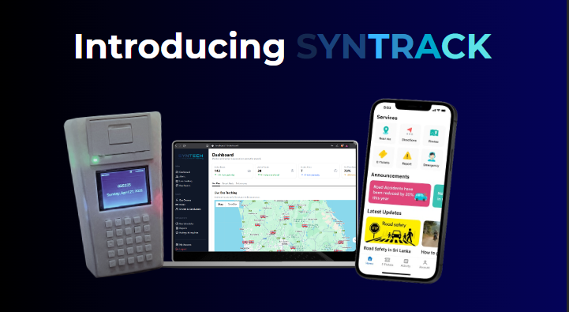
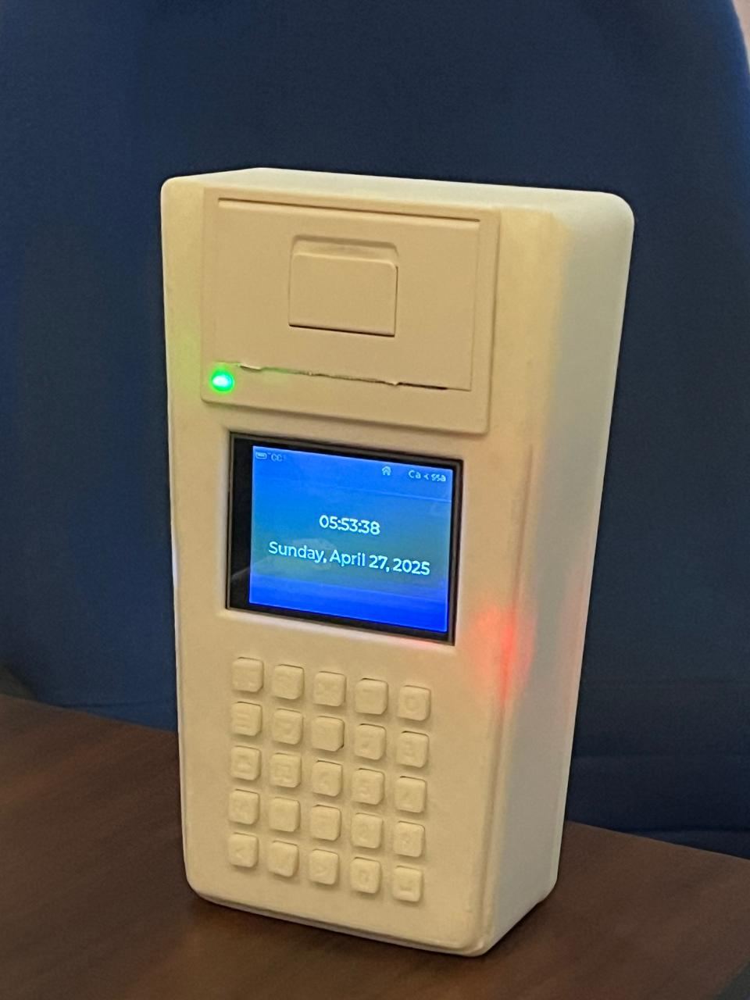
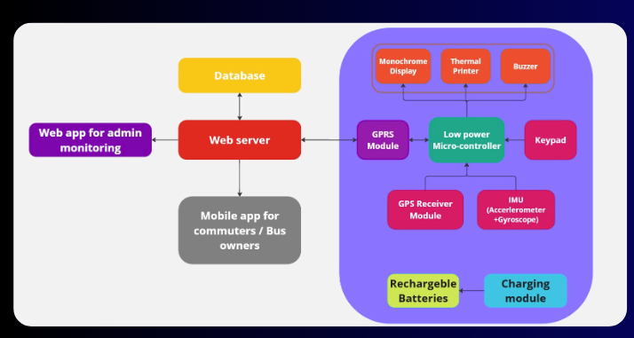
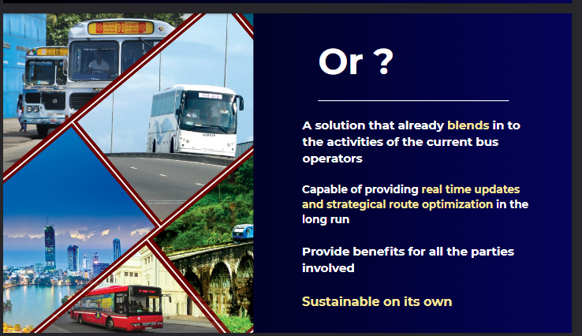

# Syntrack System

[Proposal](Readme_assets/Syntech-IoT_proposal.pdf)

[1st presentation](Readme_assets/First_Presentation.pdf)

[2nd presentation](Readme_assets/2nd_Presentation.pdf)

  <h2 style="margin:0 0 8px;">Schematic Design</h2>
  

    
    
    
    
    
    
    
    
    
    
    
  

  <h2 style="margin:0 0 8px;">PCB 2D (Routing)</h2>
  

    
    
    
    
  

  <h2 style="margin:0 0 8px;">3D View</h2>
  

    
    
  

  

    
<strong>Notes</strong>

    <ul style="margin:0 0 0 18px;">
      <li>All layers are ground-poured except the layer above the bottom layer, which is the 3.3&nbsp;V plane.</li>
      <li>Design isn’t fully complete. Midway through, due to time and budget constraints, the PCB was deprioritized. Placement and routing aren’t fully optimized; this was completed as a learning exercise to make use of the time already invested.</li>
    </ul>
  

[Some collabarative files are here too](https://github.com/KavishkaJayakody/SLIoT_Syntec) 